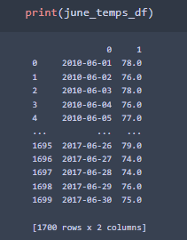
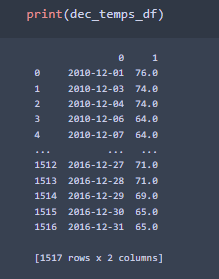

# Surfs_Up

## Resources:
*   Software:
    *   Anaconda 4.11.0
    *   Jupyter Notebook 6.4.5
    *   Python 3.9.7
    *   Visual Studio Code 1.63.2
    *   Flask (Python Web Framework)
    *   Python Libraries
        *   Pandas
        *   NumPy
        *   SQLAlchemy
        *   datetime
*   Resources:
    *   hawaii.sqlite

## Overview/Purpose:

The goal of this analysis was to use advanced data storage to extract and visualize temperature trends in June and December on the island of O'auh. This is for use with a business plan to open a Surf Shop that also serves ice cream. This analysis will help determine if the business can operate viably all year vs seasonally.

## Results:

Using `sqlalchemy` I was able to generate a query session with the local database, `hawaii.sqlite`, to extract temp data specifically for the months of June and December. After retrieving the data, they were converted to lists then DataFrames to be easily read. 

The `june_temps_df` had 1,700 rows and the `dec_temps_df` had 1,517 rows, both of which provide an excellent amount of data to get an accurate snapshot of temperatures.

Lastly, using the `.describe()` method on the DataFrames, I was able to find all relevant statistics pertaining to the temperatures during these months.

.png)
.png)

## Summary:

The finding shows that the island of O'auh would appear to be a suitable location for the business to operate all year, when considering the consistency of high temperatures. The average temperatures between June and December differ by less than 4oF and both were greater than 71oF. This means that the time of year (Summer v Winter) does not have a significant enough change to the climate that surfing and ice cream would not be a possible choice at any time, give or take the occasional cold day according to the minimum temperatures seen in the above images.

A few additional queries would be helpful to get more accurate data.

1. While it is good to see that the climate is reasonably stable enough for the business to operate all year, we **know** summer will be warm enough for surfing and ice cream. It would be a very good idea include in our analysis more than just the single month of december. We should be including **all** of winter and potentially late fall/early spring (November through March roughly). Getting data from the other months around them, or the months we would predict to have the largest temperature differences to summer, may reveal the **actual** coldest days of the year (i.e. when the possibility of the business slowing would be at its highest chance).

2. Technically the winter and summer solstices occur in December and June, taking in data from other winter and summer months (i.e. January, July, etc.) may show a more accurate picture of what winter and/or summer temperatures actually look like on the island. This follows a similar idea to the possible queries layed out above.

3. I think it would be a good idea to create a tread plot to show if there has been a steady increase/decrease in average temperatures year over year. this could be a good indication of long term prospects for the business. In addition to that, the data we collected to evaluate temperatures goes from 2010-2017, meaning that at this point in time these values are at least 5 years old. It would be a very good idea to expand the dataset to include data prior to 2010 as well as from 2017 to now and in the case of evaluating the tread of average temperatures.  

